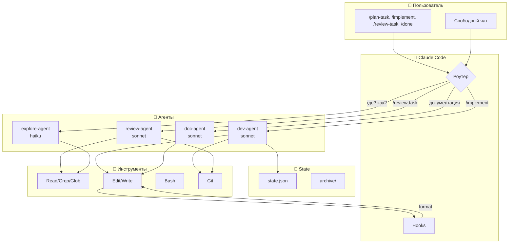
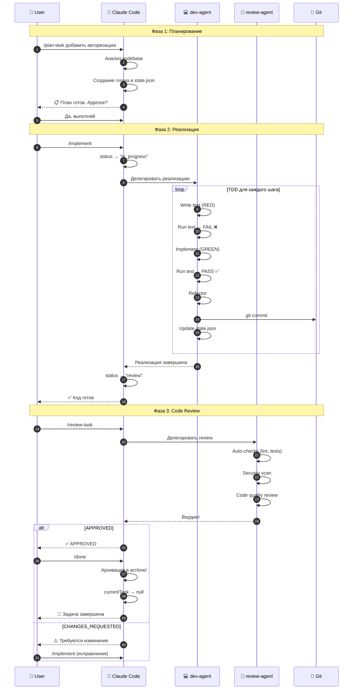
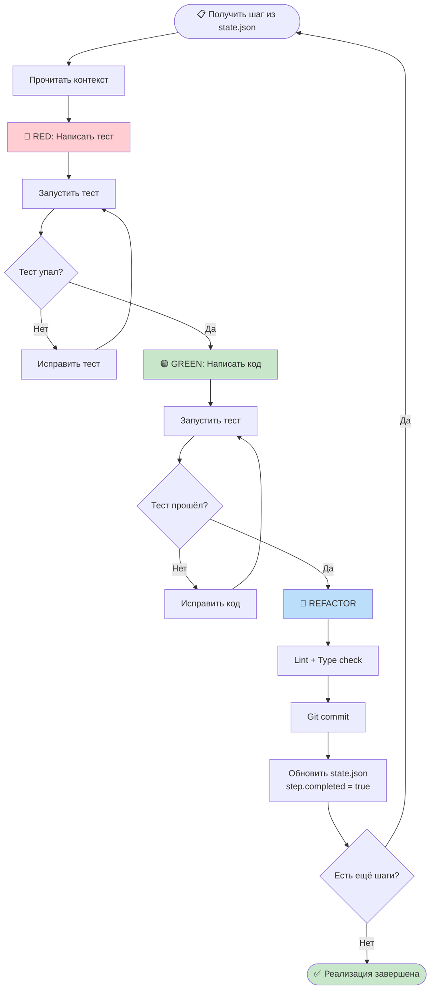
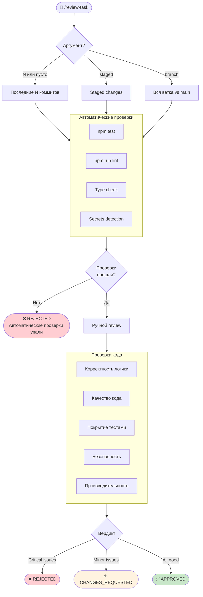
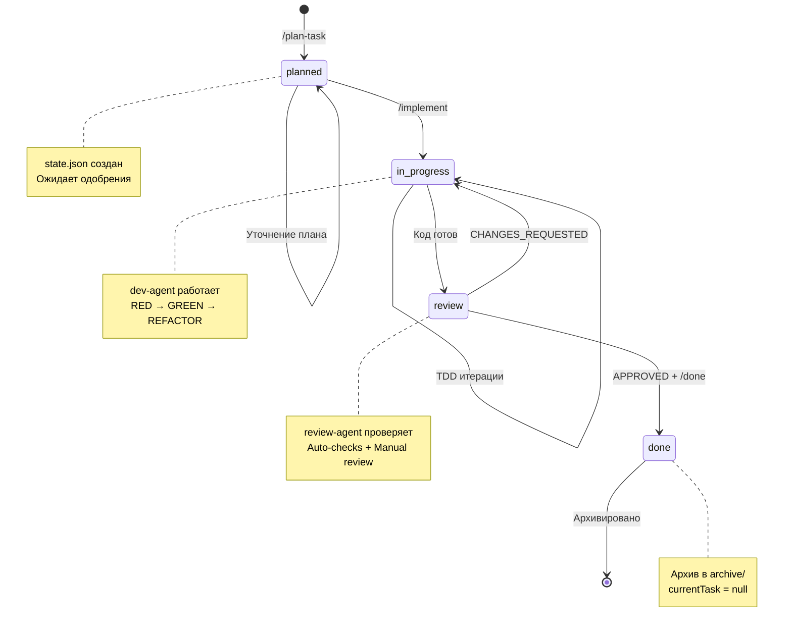
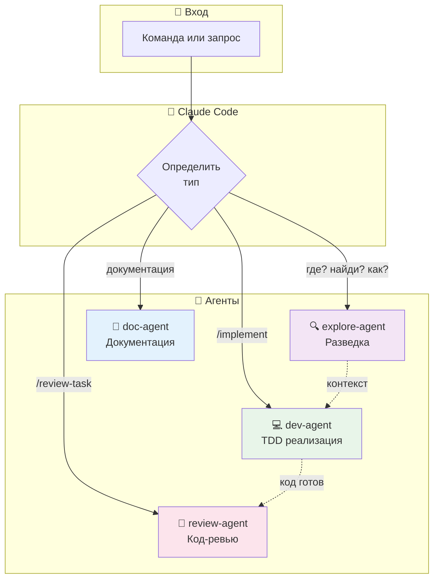

# Сценарии взаимодействия

Визуальные Mermaid-диаграммы workflow системы Claude Code Kit.

---

## 1. Архитектура системы



---

## 2. Полный цикл фичи



---

## 3. TDD цикл dev-agent



---

## 4. Quick Fix сценарий

```mermaid
flowchart TD
    START([🔧 /plan-task --quick]) --> ASSESS{Изменения<br/>< 20 LOC?}

    ASSESS -->|Нет| FULL[/plan-task без --quick]
    FULL --> FULL_FLOW([Полный цикл])

    ASSESS -->|Да| FIND[Найти проблемный код]
    FIND --> TEST[Написать тест]
    TEST --> FIX[Минимальное исправление]
    FIX --> VERIFY{Тесты OK?}

    VERIFY -->|Нет| FIX
    VERIFY -->|Да| COMMIT["git commit -m 'fix: ...'"]
    COMMIT --> DONE([✅ Исправлено])

    style START fill:#e3f2fd
    style DONE fill:#c8e6c9
```

---

## 5. GitHub Issue сценарий

```mermaid
flowchart TD
    START([📝 /plan-task --issue 123]) --> FETCH[gh issue view 123]

    FETCH --> VALID{Issue<br/>существует?}
    VALID -->|Нет| ERROR([❌ Issue not found])

    VALID -->|Да| ANALYZE[Анализ проблемы]
    ANALYZE --> SIZE{Размер<br/>фикса?}

    SIZE -->|< 20 LOC| QUICK[Quick Fix режим]
    SIZE -->|> 20 LOC| PLAN[Создать полный план]

    QUICK --> BRANCH[git checkout -b fix/issue-123]
    PLAN --> BRANCH

    BRANCH --> IMPLEMENT[/implement]
    IMPLEMENT --> TEST[Тесты проходят?]

    TEST -->|Нет| FIX[Исправить]
    FIX --> TEST

    TEST -->|Да| PUSH[git push]
    PUSH --> PR[gh pr create<br/>Fixes #123]
    PR --> DONE([✅ PR создан])

    style START fill:#fff3e0
    style DONE fill:#c8e6c9
    style ERROR fill:#ffcdd2
```

---

## 6. Code Review процесс



---

## 7. Жизненный цикл задачи



---

## 8. Выбор команды

```mermaid
flowchart TD
    START([🤔 Что делать?]) --> TYPE{Тип задачи?}

    TYPE -->|Новая фича| SIZE{Размер?}
    SIZE -->|> 50 LOC| PLAN[/plan-task feature]
    SIZE -->|< 50 LOC| PLAN_QUICK[/plan-task feature]

    TYPE -->|Баг| BUG_SIZE{Размер фикса?}
    BUG_SIZE -->|< 20 LOC| QUICK[/plan-task --quick]
    BUG_SIZE -->|> 20 LOC| PLAN

    TYPE -->|GitHub Issue| ISSUE[/plan-task --issue N]

    TYPE -->|Проверка кода| REVIEW[/review-task]

    TYPE -->|Исследование| EXPLORE[Задать вопрос<br/>→ explore-agent]

    TYPE -->|Документация| DOC[Запросить<br/>→ doc-agent]

    PLAN --> IMPLEMENT[/implement]
    PLAN_QUICK --> IMPLEMENT
    ISSUE --> IMPLEMENT
    QUICK --> IMPLEMENT

    IMPLEMENT --> REVIEW
    REVIEW --> VERDICT{Вердикт?}

    VERDICT -->|APPROVED| DONE[/done]
    VERDICT -->|CHANGES| IMPLEMENT

    DONE --> END([✅ Готово])

    style START fill:#e1f5fe
    style END fill:#c8e6c9
```

---

## 9. Взаимодействие агентов



---

## Легенда

| Символ | Значение |
|--------|----------|
| `[...]` | Процесс/Действие |
| `{...}` | Решение/Условие |
| `([...])` | Начало/Конец |
| `-->` | Переход |
| `-.->` | Делегирование |
| 🔴 | RED (failing test) |
| 🟢 | GREEN (passing test) |
| 🔵 | REFACTOR |
| ✅ | Success / APPROVED |
| ❌ | Failure / REJECTED |
| ⚠️ | CHANGES_REQUESTED |

---

## Рендеринг диаграмм

Mermaid диаграммы можно просматривать в:
- GitHub/GitLab README
- VS Code (расширение Mermaid)
- [mermaid.live](https://mermaid.live)
- Obsidian, Notion
