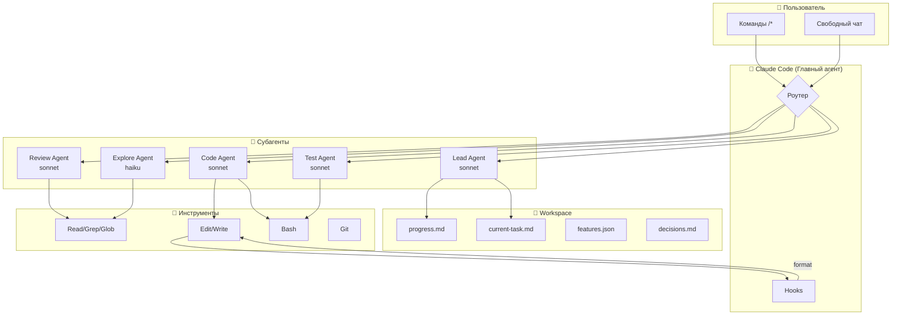
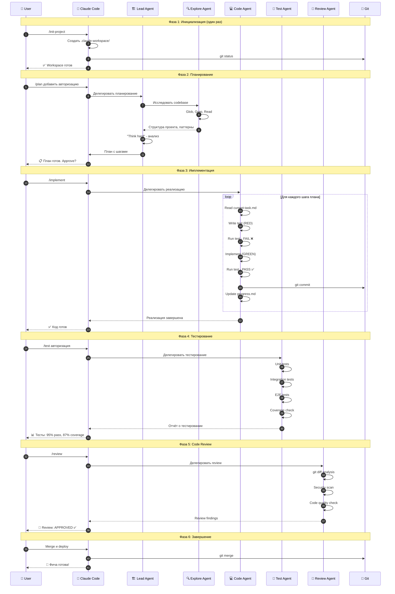
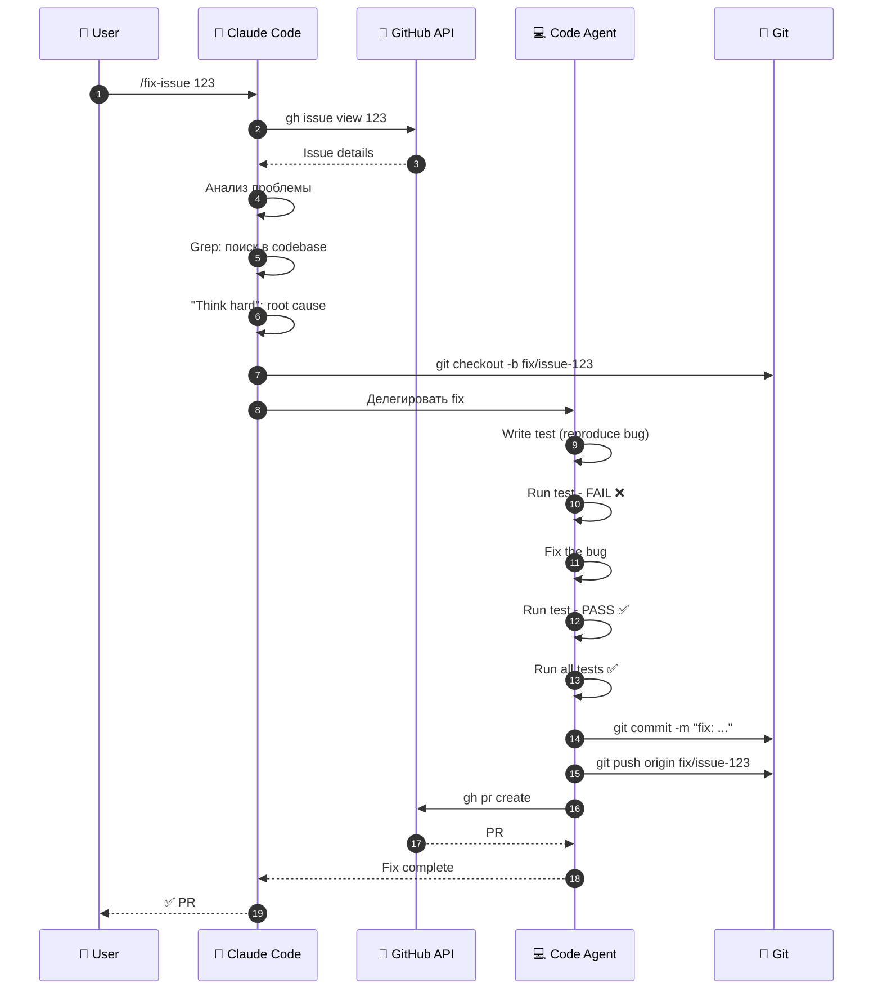
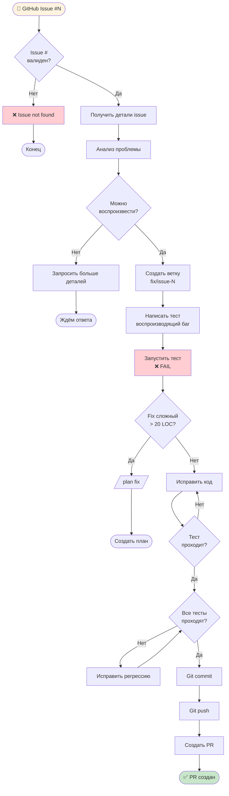
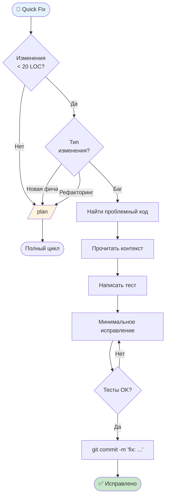
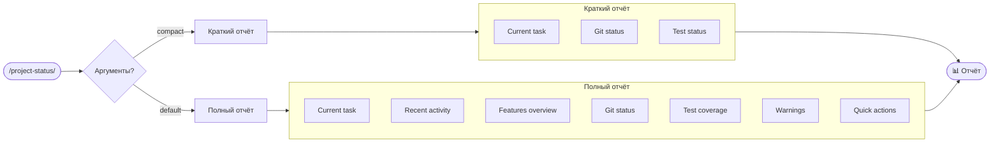
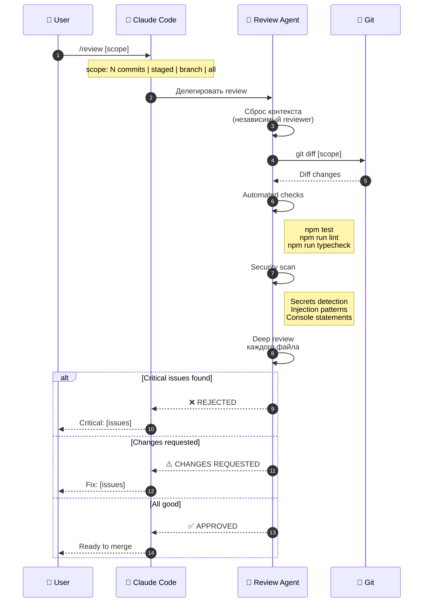
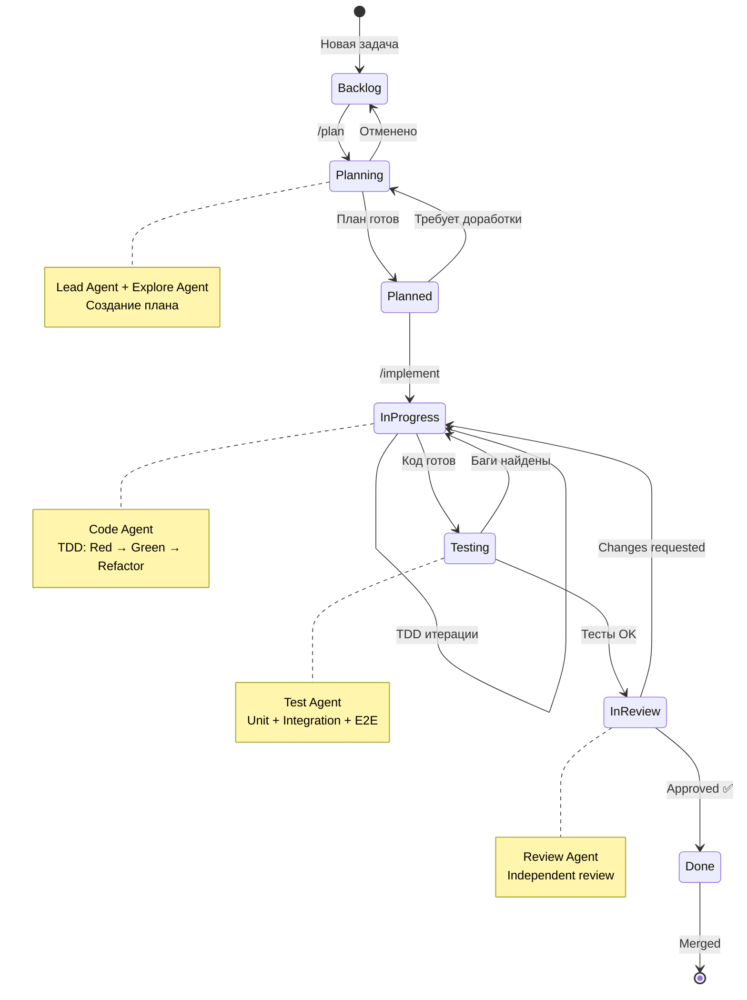
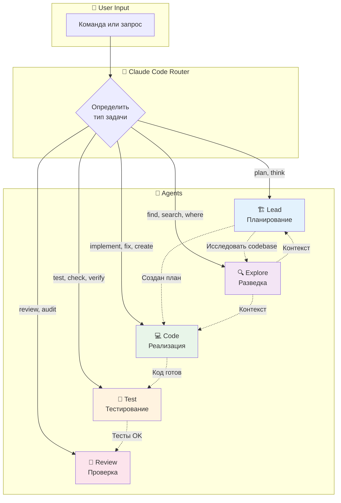

# Схемы сценариев взаимодействия

Визуальные диаграммы основных workflow при работе с системой агентов Claude Code.

---

## 1. Общая архитектура системы



---

## 2. Сценарий: Новая фича (полный цикл)

### 2.1 Sequence Diagram



### 2.2 Flowchart (процесс принятия решений)

```mermaid
flowchart TD
    START([🚀 Новая фича]) --> INIT{Workspace<br/>инициализирован?}
    
    INIT -->|Нет| INIT_CMD[/init-project]
    INIT_CMD --> PLAN
    INIT -->|Да| PLAN
    
    PLAN[/plan feature/] --> THINK[Lead Agent:<br/>Think Hard]
    THINK --> EXPLORE[Explore Agent:<br/>Исследование codebase]
    EXPLORE --> CREATE_PLAN[Создать план<br/>в current-task.md]
    CREATE_PLAN --> APPROVE{User:<br/>Approve план?}
    
    APPROVE -->|Нет| REVISE[Уточнить требования]
    REVISE --> THINK
    
    APPROVE -->|Да| IMPLEMENT[/implement/]
    
    IMPLEMENT --> STEP_LOOP{Есть ещё<br/>шаги?}
    
    STEP_LOOP -->|Да| TDD_RED[🔴 Write failing test]
    TDD_RED --> TDD_GREEN[🟢 Implement to pass]
    TDD_GREEN --> TDD_REFACTOR[🔵 Refactor if needed]
    TDD_REFACTOR --> COMMIT[Git commit]
    COMMIT --> UPDATE_PROGRESS[Update progress.md]
    UPDATE_PROGRESS --> STEP_LOOP
    
    STEP_LOOP -->|Нет| TEST[/test feature/]
    
    TEST --> TEST_RESULT{Тесты<br/>проходят?}
    
    TEST_RESULT -->|Нет| FIX_BUGS[Исправить баги]
    FIX_BUGS --> TEST
    
    TEST_RESULT -->|Да| REVIEW[/review/]
    
    REVIEW --> REVIEW_RESULT{Review<br/>пройден?}
    
    REVIEW_RESULT -->|Changes Requested| FIX_ISSUES[Исправить замечания]
    FIX_ISSUES --> REVIEW
    
    REVIEW_RESULT -->|Approved| MERGE[Git merge]
    MERGE --> DONE([✅ Фича готова])
    
    style START fill:#e1f5fe
    style DONE fill:#c8e6c9
    style TDD_RED fill:#ffcdd2
    style TDD_GREEN fill:#c8e6c9
    style TDD_REFACTOR fill:#bbdefb
```

---

## 3. Сценарий: Исправление GitHub Issue

### 3.1 Sequence Diagram



### 3.2 Flowchart



---

## 4. Сценарий: Quick Fix (быстрое исправление)



---

## 5. Сценарий: Проверка статуса



---

## 6. Сценарий: Code Review



---

## 7. Сценарий: E2E Тестирование

```mermaid
flowchart TD
    START([/test feature/]) --> SETUP[Setup test environment]
    
    SETUP --> START_SERVER{Dev server<br/>needed?}
    START_SERVER -->|Да| RUN_SERVER[npm run dev]
    START_SERVER -->|Нет| UNIT
    RUN_SERVER --> HEALTH[Health check]
    HEALTH --> UNIT
    
    UNIT[Unit Tests] --> UNIT_RESULT{Pass?}
    UNIT_RESULT -->|Нет| UNIT_FAIL[Log failures]
    UNIT_RESULT -->|Да| INTEGRATION
    UNIT_FAIL --> INTEGRATION
    
    INTEGRATION[Integration Tests] --> INT_RESULT{Pass?}
    INT_RESULT -->|Нет| INT_FAIL[Log failures]
    INT_RESULT -->|Да| E2E
    INT_FAIL --> E2E
    
    E2E{E2E method?}
    E2E -->|Playwright| PLAYWRIGHT[Browser automation]
    E2E -->|Manual| CURL[curl API tests]
    
    PLAYWRIGHT --> SCENARIOS
    CURL --> SCENARIOS
    
    SCENARIOS[Test scenarios matrix]
    
    subgraph Matrix[Scenarios]
        S1[Happy path]
        S2[Empty input]
        S3[Invalid input]
        S4[Boundary cases]
        S5[Error handling]
    end
    
    SCENARIOS --> Matrix
    Matrix --> COVERAGE[Coverage check]
    
    COVERAGE --> REPORT[Generate report]
    REPORT --> CLEANUP[Cleanup: stop server]
    CLEANUP --> RESULT{All pass?}
    
    RESULT -->|Да| SUCCESS([✅ PASS])
    RESULT -->|Частично| PARTIAL([⚠️ PARTIAL])
    RESULT -->|Нет| FAIL([❌ FAIL])
    
    style SUCCESS fill:#c8e6c9
    style PARTIAL fill:#fff3e0
    style FAIL fill:#ffcdd2
```



---

## 8. State Diagram: Жизненный цикл задачи



---

## 9. Выбор сценария (Decision Tree)

```mermaid
flowchart TD
    START([🤔 Что делать?]) --> TYPE{Тип задачи?}
    
    TYPE -->|Новая фича| SIZE{Размер?}
    SIZE -->|Большая| PLAN[/plan/]
    SIZE -->|Маленькая| QUICK_PLAN[/plan/ краткий]
    
    TYPE -->|Баг| BUG_SIZE{Размер фикса?}
    BUG_SIZE -->|< 20 LOC| QUICK[/quick-fix/]
    BUG_SIZE -->|> 20 LOC| PLAN
    
    TYPE -->|GitHub Issue| ISSUE[/fix-issue N/]
    
    TYPE -->|Проверка| CHECK{Что проверить?}
    CHECK -->|Статус| STATUS[/project-status/]
    CHECK -->|Тесты| TEST[/test/]
    CHECK -->|Код| REVIEW[/review/]
    
    TYPE -->|Исследование| EXPLORE_Q[Задать вопрос в чате<br/>→ Explore Agent]
    
    PLAN --> IMPLEMENT[/implement/]
    QUICK_PLAN --> IMPLEMENT
    
    IMPLEMENT --> TEST
    ISSUE --> REVIEW
    QUICK --> DONE
    
    TEST --> REVIEW
    REVIEW --> DONE([✅ Готово])
    
    style START fill:#e1f5fe
    style DONE fill:#c8e6c9
```

---

## 10. Взаимодействие агентов



---

## Легенда

| Символ | Значение |
|--------|----------|
| `[...]` | Процесс/Действие |
| `{...}` | Решение/Условие |
| `([...])` | Начало/Конец |
| `-->` | Переход |
| `-.->` | Делегирование/Связь |
| 🔴 | RED (failing test) |
| 🟢 | GREEN (passing test) |
| 🔵 | REFACTOR |
| ✅ | Success |
| ❌ | Failure |
| ⚠️ | Warning |

---

## Как использовать эти схемы

1. **Для обучения** — понять как работает система
2. **Для онбординга** — показать новым членам команды
3. **Для документации** — включить в README проекта
4. **Для отладки** — понять на каком этапе проблема

Схемы в формате Mermaid можно рендерить:
- В GitHub/GitLab README
- В Obsidian, Notion
- На [mermaid.live](https://mermaid.live)
- В VS Code с расширением Mermaid
